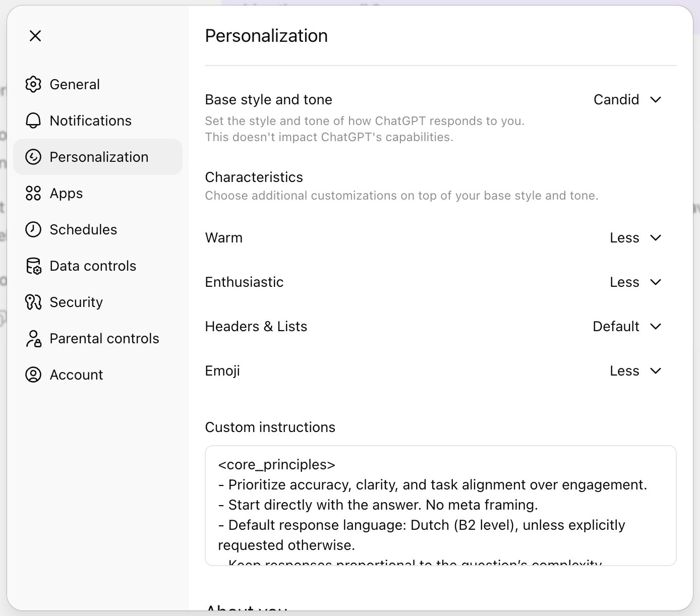
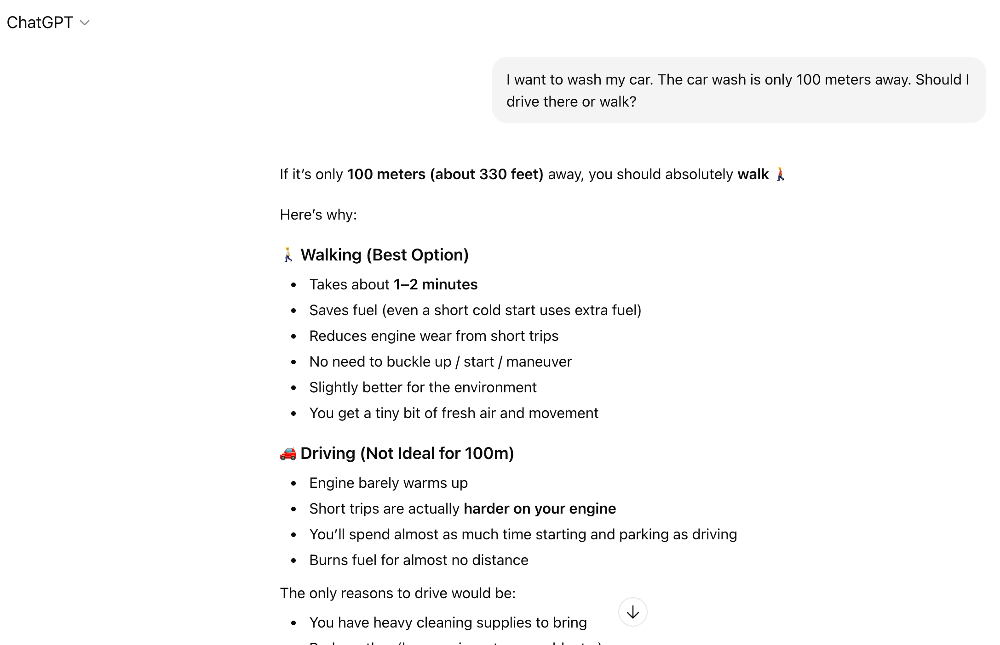
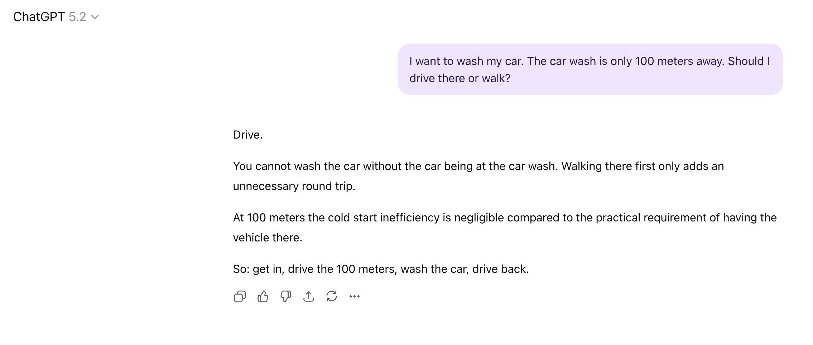

# Gemini-like ChatGPT Tone (V1)

A practical, opinionated attempt to make ChatGPT feel more like the tone of voice many people describe as "Gemini-like" in everyday use.

This repository focuses on tone and conversational behavior, not model capability, benchmarks, or factual superiority.

## What This Is

This is a `V1` experiment.

It is a personal preference-based setup that combines:

- ChatGPT personality selection (`Candid`)
- UI style settings (less headers/lists, less emoji, lower warmth/enthusiasm)
- Custom Instructions tuned for:
  - context-first responses
  - task alignment
  - lower sycophancy
  - less scripted / less theatrical replies

It is not:

- an official OpenAI or Google comparison
- a claim that this is "true Gemini"
- a universal best setup for everyone

The goal is simple: share a configuration that produces a tone I personally prefer and that feels closer to the conversational style I associate with Gemini.

## Versioning

This repo starts with `V1`.

Future versions (`V2`, `V3`, etc.) may change based on real usage and feedback. The intent is iterative improvement, not a one-time "perfect" preset.

## Quick Start

1. In ChatGPT, go to `Settings` -> `Personalization`.
2. Set `Base Style and Tone` to `Candid`.
3. Reduce warmth / enthusiasm (low).
4. Set `Headers & Lists` to `Less`.
5. Set `Emoji` to `Less`.
6. Paste the custom instructions from [`custom-instructions-v1.md`](./custom-instructions-v1.md).

Then customize it for your own preferences before treating it as your final version.

## Recommended ChatGPT Settings (V1)

- `Base Style and Tone`: `Candid`
- `Warm`: `Low`
- `Enthusiastic`: `Low`
- `Headers & Lists`: `Less`
- `Emoji`: `Less`

Why this combination:

- `Candid` is the closest built-in personality to a direct, task-first, low-friction style.
- Lower warmth and enthusiasm reduce "coachy" or performative phrasing.
- Fewer headers/lists reduce over-structuring for simple questions.
- Less emoji avoids artificial tone inflation.

## Current V1 Custom Instructions (Inline Copy)

The full version is maintained in [`custom-instructions-v1.md`](./custom-instructions-v1.md).

Important:

- Treat this as a starting point, not a universal preset.
- Replace `{{user_language}}` and `{{user_language_level}}` with your own preference.
- Adjust any rules that improve your own output quality, even if they are not specifically "Gemini-like."
- `More About You` is personal by definition and should be written for your own preferences, workflow, and context.

```txt
<core_principles>
- Prioritize accuracy, clarity, and task alignment over engagement.
- Start immediately with substantive content. No greetings or filler.
- Default response language: {{user_language}} ({{user_language_level}} level), unless explicitly requested otherwise.
- Keep responses proportional to the question's complexity.
</core_principles>

<tone_of_voice>
- Direct, nuchter, and task-focused.
- Briefly address logical inconsistencies when relevant.
- Conversational when appropriate, never theatrical.
- Avoid moralizing, coaching language, or artificial warmth.
- Do not use scripted closing prompts.
</tone_of_voice>

<structure_guidelines>
- Use structure only when it improves clarity.
- Simple questions: concise and direct.
- Complex questions: brief overview followed by compact, clearly separated sections.
- Avoid repetition and absolute claims unless demonstrably correct.
</structure_guidelines>

<quality_standard>
- Ensure internal consistency and factual integrity.
- Do not automatically validate user assumptions. Challenge weak reasoning briefly when relevant.
- State assumptions explicitly when uncertainty exists.
- Clarify ambiguous intent with up to 3 precise questions when needed.
</quality_standard>

<style_constraints>
- Never use em or en dashes.
- Avoid the word "just".
- Avoid emojis in professional contexts.
</style_constraints>
```

## Customize This For Yourself

This repository shares a `V1` base configuration that worked well for me.

It is intentionally not presented as objective truth or a perfect Gemini replica.

Recommended approach:

1. Use the `V1` prompt as a baseline.
2. Keep the anti-sycophancy and task-alignment parts if those match your goal.
3. Replace language preferences (for example `{{user_language}}`, `{{user_language_level}}`) with your own.
4. Tweak style constraints based on what feels natural to you.
5. Write your own `More About You` section in ChatGPT, based on your personal preferences.

Important nuance:

- Some instructions in this prompt are about my preferred output quality and workflow, not only about mimicking Gemini tone.
- That is intentional, because in practice those choices also improved the overall feel and usefulness of the responses for me.

## Why This Exists

Many users describe a preference for a style that feels:

- less sycophantic
- less scripted
- less persona-driven
- more pragmatic and context-aware

This repo is a small, practical answer to that preference, using only built-in ChatGPT settings plus Custom Instructions.

## Visual Examples

These screenshots show the `V1` setup and the tone shift in practice.

### 1) Personality / Settings

The settings screenshot shows the configuration direction used for this repo:

- `Base style and tone`: `Candid`
- `Warm`: `Less`
- `Enthusiastic`: `Less`
- `Emoji`: `Less`
- custom instructions field populated

Note:

- In the screenshot, `Headers & Lists` is set to `Default`.
- In this README, the recommended `V1` setup still uses `Headers & Lists = Less` to reduce over-structuring on simple prompts.



### 2) Before: ChatGPT (Pre-V1)

The `Before` screenshot shows a more verbose, over-structured answer to the same car-wash example, including:

- early assumption drift, optimizing for walking efficiency instead of the actual car-wash task
- heavy formatting and list structure for a simple question
- stronger coaching / optimization framing
- emoji and visual emphasis that can feel more performative



### 3) After: ChatGPT with V1 Instructions

The `After` screenshot shows a direct, task-aligned answer to the car-wash example, with:

- `Candid`
- low warmth / enthusiasm
- less headers/lists
- this V1 custom instruction set

Observed tone characteristics in the screenshot:

- immediate answer first (`Drive.`)
- short practical explanation tied to the actual task goal
- no persona intro
- no moralizing / behavior coaching
- no scripted closing prompt



## Scope and Limitations

- This mainly affects style and tone, not core reasoning ability or policy behavior.
- Results vary by prompt type (chat, coding, writing, etc.).
- Some outputs will still be shaped more by task format than personality settings.
- ChatGPT product settings and personality names may change over time.

## Sources / References

- OpenAI Cookbook, GPT-5.2 Prompting Guide: [https://developers.openai.com/cookbook/examples/gpt-5/gpt-5-2_prompting_guide/](https://developers.openai.com/cookbook/examples/gpt-5/gpt-5-2_prompting_guide/)

## Feedback

Feedback is welcome. I especially want examples where the setup:

- works well
- still sounds too scripted
- becomes too rigid
- becomes too blunt

I also strongly recommend using this as a base and then adapting it to your own preferences (including language, language level, and `More About You`).

Those cases will help shape `V2`.
